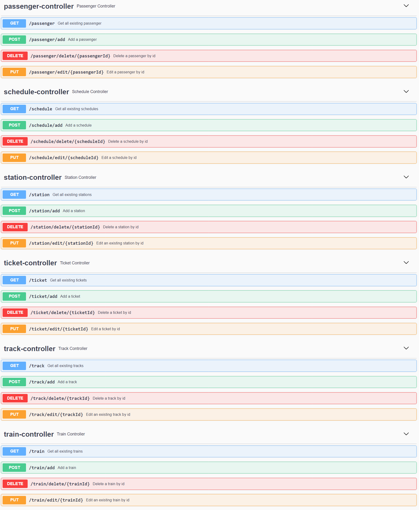

# Trains management application

## Project description

The scope of this application is to create a medium that can be used for trains and railways managemnt. The user can manage trains, their schedule, tickets, stations, passengers and tracks for trains

## Business Requirements:
1. Information about schedules delays
2. Buying train tickets for different routes
3. Displaying the ticket fees for different routes
4. Displaying the schedule for any train
5. Information about tracks for every station
6. Having details about a train
7. Managing stations
8. Keeping track of train tickets for passengers
9. Adding new tracks
10. Evidence of the passengers

## Main Features:
1. Administration of train tickets for passengers
2. Administration of train routes between destinations
3. Information about train schedules
4. Evidence of all the train tracks
5. Evidence of tickets history

## Endpoints:

____
## Schemas:
![schemas}(./resources/schemas.png)
